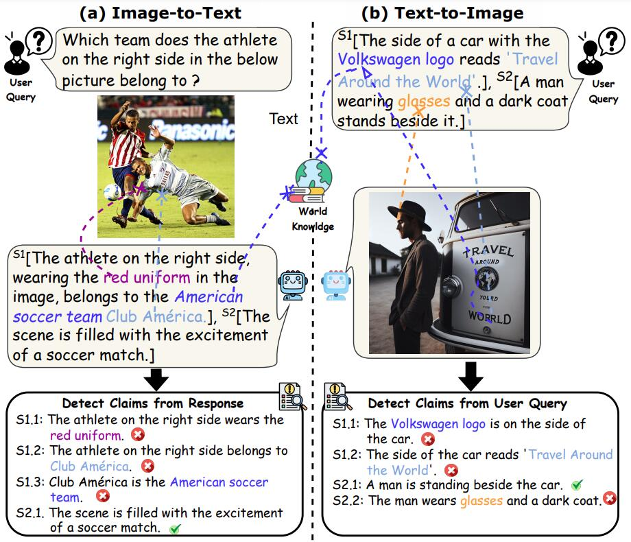

<div align="center">


**An Easy-to-Use Multimodal Hallucination Detection Framework for MLLMs**
 
---

<p align="center">
  <a href="https://huggingface.co/spaces/zjunlp/MHaluBench">Datasets</a> •
  <a href="#overview">Overview</a> •
  <a href="#quickstart">Quickstart</a> •
  <a href="#citation">Citation</a> •
  <a href="#contributors">Contributors</a>
</p>


[](https://opensource.org/licenses/MIT)
 
 

</div>

## Table of Contents

<!-- - <a href="#news">What's New</a> -->
- <a href="#overview">Overview</a>
  - <a href="#unified-multimodal-hallucination">Unified Multimodal Hallucination </a>
  - <a href="#dataset-mhallubench-statistic">Dataset: MHalluBench Statistic</a>
  - <a href="#framework-uniHD-illustration">Framework: UniHD Illustration</a>
- <a href="#quickstart">Quickstart</a>
  - <a href="#shell-script">Shell Script</a>
  - <a href="#gradio-app">Gradio App</a>
- <a href="#citation">Citation</a>
- <a href="#contributors">Contributors</a>
---


## 🌟Overview


EasyDetect is a systematic package which is proposed as an easy-to-use hallucination detection framework for Multimodal Large Language Models(MLLMs) like GPT-4V, Gemini, LlaVA in your research experiments. 

### Unified Multimodal Hallucination

#### Unified View of Detection

A prerequisite for unified detection is the coherent categorization of the principal categories of hallucinations within MLLMs. Our paper superficially examines the following Hallucination Taxonomy from a unified perspective:

<p align="center">


</p>

**Figure 1:** Unified multimodal hallucination detection aims to identify and detect modality-conflicting hallucinations at
various levels such as object, attribute, and scene-text, as well as fact-conflicting hallucinations in both image-to-text and text-to-image generation.

**Modality-Conflicting Hallucination.**  MLLMs sometimes generate outputs that conflict with inputs from other modalities, leading to issues such as incorrect objects, attributes, or scene text. An example in above Figure (a)
 includes an MLLM inaccurately describing an athlete's uniform color, showcasing an attribute-level conflict due to MLLMs' limited ability to achieve fine-grained text-image alignment.
 **Fact-Conflicting Hallucination.** Outputs from MLLMs may contradict established factual knowledge. Image-to-text models can generate narratives that stray from the actual content by incorporating irrelevant facts, while text-to-image models may produce visuals that fail to reflect the factual knowledge contained in text prompts. These discrepancies underline the struggle of MLLMs to maintain factual consistency, representing a significant challenge in the domain.

#### Fine-grained Detection Task Definition

Unified detection of multimodal hallucination necessitates the check of each image-text pair `a={v, x}`, wherein `v` denotes either the visual input provided to an MLLM, or the visual output synthesized by it. Correspondingly, `x` signifies the MLLM's generated textual response based on `v` or the textual user query for synthesizing `v`. Within this task, each `x` may contain multiple claims, denoted as $\{c_i\}\_\{i = 1 \cdots n\}$. The objective for hallucination detectors is to assess each claim from `a` to determine whether it is "hallucinatory" or "non-hallucinatory", providing a rationale for their judgments based on the provided definition of hallucination. Text hallucination detection from LLMs denotes a sub-case in this setting, where `v` is null.

### Dataset: MHalluBench Statistic

To advance this research trajectory, we introduce the meta-evaluation benchmark MHaluBench, which encompasses the content from image-to-text and text-to-image generation, aiming to rigorously assess the advancements in multimodal halluci-
nation detectors. Further statistical details about MHaluBench are provided in below Figures.


**Table 1:** *A comparison of benchmarks with respect to existing fact-checking or hallucination evaluation.* "Check." indicates verifying factual consistency, "Eval." denotes evaluating hallucinations generated by different LLMs, and its response is based on different LLMs under test, while "Det." embodies the evaluation of a detector’s capability in identifying hallucinations.

<p align="center">
  
</p>

**Figure 2:** *Claim-Level data statistics of MHaluBench.* "IC" signifies Image Captioning and "T2I" indicates Text-to-Image synthesis, respectively.

<p align="center">

</p>

**Figure 3:** *Distribution of hallucination categories within hallucination-labeled claims of MHaluBench.* 

### Framework: UniHD Illustration

Addressing the key challenges in hallucination detection, we introduce a unified framework in Figure 4 that systematically tackles multimodal hallucination identification for both image-to-text and text-to-image tasks. Our framework capitalizes on the domain-specific strengths of various tools to efficiently gather multi-modal evidence for confirming hallucinations. 


**Figure 4:** *The specific illustration of UniHD for unified multimodal hallucination detection.* 

---

## ⏩Quickstart

We provide two ways for users to quickly get started with EasyInstruct. You can either use the shell script or the Gradio app based on your specific needs.

### Shell Script

#### Step1: Write a configuration file in yaml format

Users can easily configure the parameters of EasyInstruct in a yaml file or just quickly use the default parameters in the configuration file we provide. Following is an example of the configuration file for Self-Instruct.

```yaml
generator:
  SelfInstructGenerator:
    target_dir: data/generations/
    data_format: alpaca
    seed_tasks_path: data/seed_tasks.jsonl
    generated_instructions_path: generated_instructions.jsonl
    generated_instances_path: generated_instances.jsonl
    num_instructions_to_generate: 100
    engine: gpt-3.5-turbo
    num_prompt_instructions: 8
```

More example configuration files can be found at [configs](https://github.com/zjunlp/EasyInstruct/tree/main/configs).

#### Step2: Run the shell script

Users should first specify the configuration file and provide their own OpenAI API key. Then, run the follwing shell script to launch the instruction generation or selection process.

```shell
config_file=""
openai_api_key=""

python demo/run.py \
    --config  $config_file\
    --openai_api_key $openai_api_key \
```


---
### 🚩Citation

Please cite our repository if you use EasyDetect in your work.

```bibtex
@article{chen2024factchd,
        title={FactCHD: Benchmarking Fact-Conflicting Hallucination Detection}, 
        author={Xiang Chen and Duanzheng Song and Honghao Gui and Chenxi Wang and Ningyu Zhang 
          and Jiang Yong and Fei Huang and Chengfei Lv and Dan Zhang and Huajun Chen},
        year={2024},
        eprint={2310.12086},
        archivePrefix={arXiv},
        primaryClass={cs.CL}
}

@article{chen2024UniHD,
  author       = {Xiang Chen and Chenxi Wang and Yida Xue, Ningyu Zhang 
    and Xiaoyan Yang and Qiang Li and Yue Shen and Jinjie Gu and Huajun Chen},
  title        = {Unified Hallucination Detection for Multimodal Large Language Models},
  journal      = {CoRR},
  year         = {2024},
  eprinttype   = {arXiv},
  eprint       = {2401.05268},
} 
```

---

## 🎉Contributors

<a href="https://github.com/OpenKG-ORG/EasyDetect/graphs/contributors">
  
</a>

We will offer long-term maintenance to fix bugs, solve issues and meet new requests. So if you have any problems, please put issues to us.
