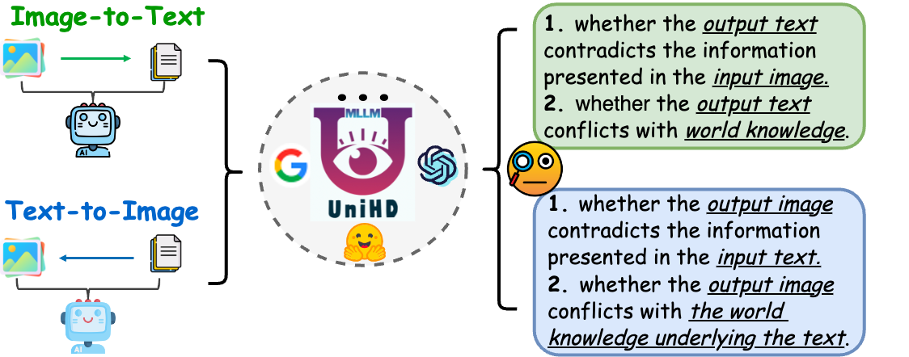
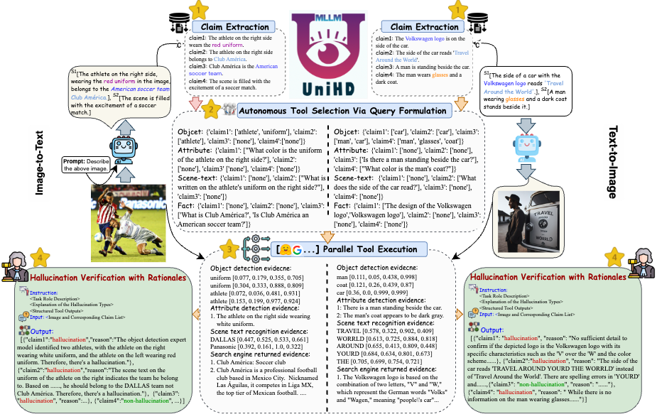

<div align="center">


**An Easy-to-Use Multimodal Hallucination Detection Framework for MLLMs**
 
---

<p align="center">
  <a href="#citation">🌻Acknowledgement</a> •
  <a href="https://huggingface.co/spaces/openkg/MHaluBench">🤗Benchmark</a> •
  <a href="http://easydetect.openkg.cn/">🍎Demo</a> •
  <a href="#overview">🌟Overview</a> •
  <a href="#installation">🔧Installation</a> •
  <a href="#quickstart">⏩Quickstart</a> •
  <a href="#citation">🚩Citation</a> 
  <!-- <a href="#contributors">🎉Contributors</a> -->
</p>


 
 
<!-- [](https://opensource.org/licenses/MIT) -->

</div>

## Table of Contents

- <a href="#acknowledgement">🌻Acknowledgement</a>
- <a href="#overview">🌟Overview</a>
  - <a href="#unified-multimodal-hallucination">Unified Multimodal Hallucination </a>
  - <a href="#dataset-mhallubench-statistic">Dataset: MHalluBench Statistic</a>
  - <a href="#framework-uniHD-illustration">Framework: UniHD Illustration</a>
- <a href="#installation">🔧Installation</a>
- <a href="#quickstart">⏩Quickstart</a>
- <a href="#citation">🚩Citation</a>
---

## 🌻Acknowledgement

Part implementation of this project were assisted and inspired by the related hallucination toolkits including [FactTool](https://github.com/GAIR-NLP/factool), [Woodpecker](https://github.com/BradyFU/Woodpecker), and others. 
This repository also benefits from the public project from [mPLUG-Owl](https://github.com/X-PLUG/mPLUG-Owl), [MiniGPT-4](https://github.com/Vision-CAIR/MiniGPT-4), [LLaVA](https://github.com/haotian-liu/LLaVA), [GroundingDINO](https://github.com/IDEA-Research/GroundingDINO), and [MAERec ](https://github.com/Mountchicken/Union14M). 
We follow the same license for open-sourcing and thank them for their contributions to the community.


## 🌟Overview

EasyDetect is a systematic package which is proposed as an easy-to-use hallucination detection framework for Multimodal Large Language Models(MLLMs) like GPT-4V, Gemini, LlaVA in your research experiments. 

### Unified Multimodal Hallucination

#### Unified View of Detection

A prerequisite for unified detection is the coherent categorization of the principal categories of hallucinations within MLLMs. Our paper superficially examines the following Hallucination Taxonomy from a unified perspective:

<p align="center">


</p>

**Figure 1:** Unified multimodal hallucination detection aims to identify and detect modality-conflicting hallucinations at
various levels such as object, attribute, and scene-text, as well as fact-conflicting hallucinations in both image-to-text and text-to-image generation.

**Modality-Conflicting Hallucination.**  MLLMs sometimes generate outputs that conflict with inputs from other modalities, leading to issues such as incorrect objects, attributes, or scene text. An example in above Figure (a) includes an MLLM inaccurately describing an athlete's uniform color, showcasing an attribute-level conflict due to MLLMs' limited ability to achieve fine-grained text-image alignment.

**Fact-Conflicting Hallucination.** Outputs from MLLMs may contradict established factual knowledge. Image-to-text models can generate narratives that stray from the actual content by incorporating irrelevant facts, while text-to-image models may produce visuals that fail to reflect the factual knowledge contained in text prompts. These discrepancies underline the struggle of MLLMs to maintain factual consistency, representing a significant challenge in the domain.

#### Fine-grained Detection Task Definition

Unified detection of multimodal hallucination necessitates the check of each image-text pair `a={v, x}`, wherein `v` denotes either the visual input provided to an MLLM, or the visual output synthesized by it. Correspondingly, `x` signifies the MLLM's generated textual response based on `v` or the textual user query for synthesizing `v`. Within this task, each `x` may contain multiple claims, denoted as $\{c_i\}\_\{i = 1 \cdots n\}$. The objective for hallucination detectors is to assess each claim from `a` to determine whether it is "hallucinatory" or "non-hallucinatory", providing a rationale for their judgments based on the provided definition of hallucination. Text hallucination detection from LLMs denotes a sub-case in this setting, where `v` is null.

### Dataset: MHalluBench Statistic

To advance this research trajectory, we introduce the meta-evaluation benchmark MHaluBench, which encompasses the content from image-to-text and text-to-image generation, aiming to rigorously assess the advancements in multimodal halluci-
nation detectors. Further statistical details about MHaluBench are provided in below Figures.


**Table 1:** *A comparison of benchmarks with respect to existing fact-checking or hallucination evaluation.* "Check." indicates verifying factual consistency, "Eval." denotes evaluating hallucinations generated by different LLMs, and its response is based on different LLMs under test, while "Det." embodies the evaluation of a detector’s capability in identifying hallucinations.

<p align="center">
  
</p>

**Figure 2:** *Claim-Level data statistics of MHaluBench.* "IC" signifies Image Captioning and "T2I" indicates Text-to-Image synthesis, respectively.

<p align="center">

</p>

**Figure 3:** *Distribution of hallucination categories within hallucination-labeled claims of MHaluBench.* 

### Framework: UniHD Illustration

Addressing the key challenges in hallucination detection, we introduce a unified framework in Figure 4 that systematically tackles multimodal hallucination identification for both image-to-text and text-to-image tasks. Our framework capitalizes on the domain-specific strengths of various tools to efficiently gather multi-modal evidence for confirming hallucinations. 



**Figure 4:** *The specific illustration of UniHD for unified multimodal hallucination detection.* 

---

## 🔧Installation

**Installation for local development:**
```
git clone https://github.com/OpenKG-ORG/EasyDetect.git
cd EasyDetect
pip install -r requirements.txt
```

**Installation for tools(GroundingDINO and MAERec):**
```
# install GroundingDINO
git clone https://github.com/IDEA-Research/GroundingDINO.git
cp -r GroundingDINO EasyDetect/GroundingDINO
cd EasyDetect/GroundingDINO/
pip install -e .
cd ..

# install MAERec
git clone https://github.com/Mountchicken/Union14M.git
cp -r Union14M/mmocr-dev-1.x EasyDetect/mmocr
cd EasyDetect/mmocr/
pip install -U openmim
mim install mmengine
mim install mmcv
mim install mmdet
pip install timm
pip install -r requirements/albu.txt
pip install -r requirements.txt
pip install -v -e .
cd ..

mkdir weights
cd weights
wget -q https://github.com/IDEA-Research/GroundingDINO/releases/download/v0.1.0-alpha/groundingdino_swint_ogc.pth
wget https://download.openmmlab.com/mmocr/textdet/dbnetpp/dbnetpp_resnet50-oclip_fpnc_1200e_icdar2015/dbnetpp_resnet50-oclip_fpnc_1200e_icdar2015_20221101_124139-4ecb39ac.pth -O dbnetpp.pth
wget https://github.com/Mountchicken/Union14M/releases/download/Checkpoint/maerec_b_union14m.pth -O maerec_b.pth
cd ..
```

---

## ⏩Quickstart

We provide example code for users to quickly get started with EasyDetect.

#### Step1: Write a configuration file in yaml format

Users can easily configure the parameters of EasyDetect in a yaml file or just quickly use the default parameters in the configuration file we provide. The path of the configuration file is EasyDetect/pipeline/config/config.yaml

```yaml
openai:
  api_key: Input your openai api key
  base_url: Input base_url, default is None
  temperature: 0.2  
  max_tokens: 1024
tool: 
  detect:
    groundingdino_config: the path of GroundingDINO_SwinT_OGC.py
    model_path: the path of groundingdino_swint_ogc.pth
    device: cuda:0
    BOX_TRESHOLD: 0.35
    TEXT_TRESHOLD: 0.25
    AREA_THRESHOLD: 0.001
  ocr:
    dbnetpp_config: the path of dbnetpp_resnet50-oclip_fpnc_1200e_icdar2015.py
    dbnetpp_path: the path of dbnetpp.pth
    maerec_config: the path of maerec_b_union14m.py
    maerec_path: the path of maerec_b.pth
    device: cuda:0
    content: word.number
    cachefiles_path: the path of cache_files to save temp images
    BOX_TRESHOLD: 0.2
    TEXT_TRESHOLD: 0.25
  google_serper:
    serper_api_key: Input your serper api key
    snippet_cnt: 10
prompts:
  claim_generate: pipeline/prompts/claim_generate.yaml
  query_generate: pipeline/prompts/query_generate.yaml
  verify: pipeline/prompts/verify.yaml
```

#### Step2: Run with the Example Code
Example Code
```python
from pipeline.run_pipeline import *
pipeline = Pipeline()
text = "The cafe in the image is named \"Hauptbahnhof\""
image_path = "./examples/058214af21a03013.jpg"
type = "image-to-text"
response, claim_list = pipeline.run_pipeline(text=text, image_path=filepath, type=type)
print(response)
print(claim_list)
```


---
## 🚩Citation

Please cite our repository if you use EasyDetect in your work.

```bibtex
@article{chen23factchd,
  author       = {Xiang Chen and Duanzheng Song and Honghao Gui and Chengxi Wang and Ningyu Zhang and 
                  Jiang Yong and Fei Huang and Chengfei Lv and Dan Zhang and Huajun Chen},
  title        = {FactCHD: Benchmarking Fact-Conflicting Hallucination Detection},
  journal      = {CoRR},
  volume       = {abs/2310.12086},
  year         = {2023},
  url          = {https://doi.org/10.48550/arXiv.2310.12086},
  doi          = {10.48550/ARXIV.2310.12086},
  eprinttype    = {arXiv},
  eprint       = {2310.12086},
  timestamp    = {Thu, 01 Feb 2024 09:55:04 +0100},
  biburl       = {https://dblp.org/rec/journals/corr/abs-2310-12086.bib},
  bibsource    = {dblp computer science bibliography, https://dblp.org}
}
@article{chen2024unified,
  author       = {Xiang Chen and Chenxi Wang and Yida Xue and Ningyu Zhang and Xiaoyan Yang and 
                  Qiang Li and Yue Shen and Lei Liang and Jinjie Gu and Huajun Chen},
  title        = {Unified Hallucination Detection for Multimodal Large Language Models},
  journal      = {CoRR},
  volume       = {abs/2402.03190},
  year         = {2024},
  url          = {https://doi.org/10.48550/arXiv.2402.03190},
  doi          = {10.48550/ARXIV.2402.03190},
  eprinttype    = {arXiv},
  eprint       = {2402.03190},
  timestamp    = {Mon, 12 Feb 2024 13:36:38 +0100},
  biburl       = {https://dblp.org/rec/journals/corr/abs-2402-03190.bib},
  bibsource    = {dblp computer science bibliography, https://dblp.org}
}
```

---


## 🎉Contributors

<a href="https://github.com/OpenKG-ORG/EasyDetect/graphs/contributors">
  
</a>

We will offer long-term maintenance to fix bugs, solve issues and meet new requests. So if you have any problems, please put issues to us.
